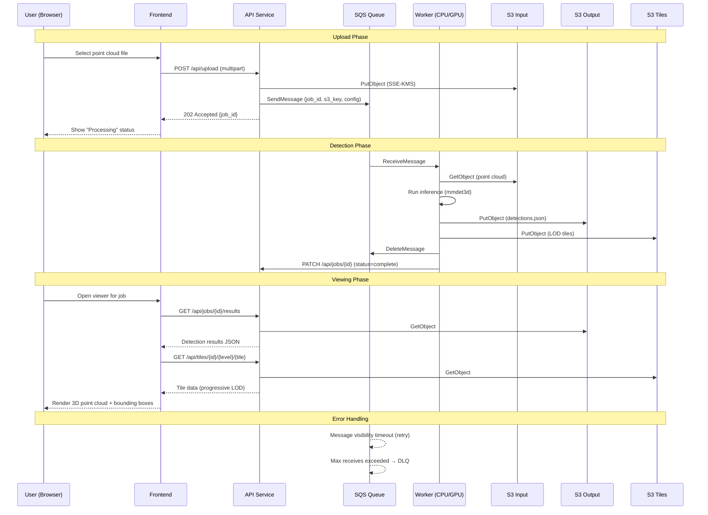

# Data Flow Diagram

End-to-end data flow from point cloud upload through detection to result viewing.

```mermaid
sequenceDiagram
    participant U as User (Browser)
    participant FE as Frontend
    participant API as API Service
    participant SQS as SQS Queue
    participant W as Worker (CPU/GPU)
    participant S3I as S3 Input
    participant S3O as S3 Output
    participant S3T as S3 Tiles

    Note over U,S3T: Upload Phase
    U->>FE: Select point cloud file
    FE->>API: POST /api/upload (multipart)
    API->>S3I: PutObject (SSE-KMS)
    API->>SQS: SendMessage (job_id, s3_key, config)
    API-->>FE: 202 Accepted {job_id}
    FE-->>U: Show "Processing" status

    Note over U,S3T: Detection Phase
    SQS->>W: ReceiveMessage
    W->>S3I: GetObject (point cloud)
    W->>W: Run inference (mmdet3d)
    W->>S3O: PutObject (detections.json)
    W->>S3T: PutObject (LOD tiles)
    W->>SQS: DeleteMessage
    W->>API: PATCH /api/jobs/{id} (status=complete)

    Note over U,S3T: Viewing Phase
    U->>FE: Open viewer for job
    FE->>API: GET /api/jobs/{id}/results
    API->>S3O: GetObject
    API-->>FE: Detection results JSON
    FE->>API: GET /api/tiles/{id}/{level}/{tile}
    API->>S3T: GetObject
    API-->>FE: Tile data (progressive LOD)
    FE-->>U: Render 3D point cloud + bounding boxes

    Note over U,S3T: Error Handling
    SQS-->>SQS: Message visibility timeout (retry)
    SQS-->>SQS: Max receives exceeded → DLQ
```
